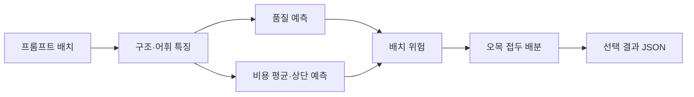

<!--
SPDX-FileCopyrightText: Copyright 2026 Scrooge Router contributors
SPDX-License-Identifier: Apache-2.0
-->

# 아키텍처

라우터는 프롬프트 묶음 하나를 받아 문항마다 모델 하나를 고른 JSON을
내놓습니다. 모델을 호출하지 않고, 네트워크도 쓰지 않으며, 표준 라이브러리만
사용합니다. 제출 진입점은 `distributional_router`입니다.

## 전체 흐름

특징은 프롬프트 텍스트에서만 뽑습니다. 문항 ID, 입력 순서, 등급 이름,
정답은 읽지 않습니다. 같은 프롬프트는 배치 안 어디에 있든 같은 결과를
받습니다. 내용이 같은 문항은 한 묶음으로 올려서, 한쪽만 비싼 모델로
가는 일을 막습니다.

학습은 실행 시점에 하지 않습니다. 어휘, 트리, 계열 보정, 등급별 상한은
동결된 JSON에 들어 있습니다.

## 제출 라우터

`distributional_router`가 특징부터 배분까지 한 경로로 처리합니다. 이전 계열 가드와
예산 브레이크 계층은 저장소에 비교용으로 남겨 두었고, 제출 이미지는 이
모듈과 그 아티팩트만 실행합니다.

### 특징

문항 하나에서 두 갈래를 뽑습니다.

- 구조 특징. 길이, 단어 수, 문장 수, 한글 비율, 코드·수식 표기처럼
  프롬프트에서 바로 세는 값입니다.
- 고정 어휘. 학습 때 고른 1,024개 토큰의 등장 여부입니다. 실행 중에는
  어휘를 늘리거나 바꾸지 않습니다.

계열 이름은 이전 라우터와 같은 `prompt_family` 규칙을 씁니다. 비용 보정의
묶음으로만 쓰고, 배분이 계열 이름을 직접 고르지는 않습니다.

### 품질과 비용 분포

모델마다 품질 헤드, 비용 평균 헤드, 비용 중앙·상단 헤드가 있습니다.
모두 동결된 기울기 부스팅 트리입니다. 비용 상단은 중앙과 90백분위 중
큰 쪽을 쓰고, 계열별 보정 배수를 곱합니다.

배분이 실제 비용 대신 보는 값은 평균만이 아닙니다. 상단이 평균보다
큰 만큼을 등급별 가중치로 더해, 예측이 위를 향하는 문항을 비싸게
계산합니다. Fast는 그 가중치가 작고 Premium의 think 모델은 더 큽니다.

### 배치 위험

내용이 128종류보다 적으면 배운 경로 대신 승격을 제한합니다. 묶음이
작을수록 사용 비율을 경량 모델 쪽으로 당기고,
Light 비용의 아래쪽 꼬리와 계열별 상단 보정을 함께 씁니다. 그 위에서는
배치의 계열 구성이 학습 분포와 얼마나 다른지를 재고, 차이가 클수록
사용 비율을 내립니다. 특징을 뽑기 전에 줄바꿈과 줄 끝 공백, Unicode
정규화만 고칩니다. 선택지 표기는 그대로 둡니다.

Fast와 Balanced는 여기에 배치 위험 헤드를 더합니다. 배치 크기와 계열
집중도, 예측 비용 비율 같은 요약으로 낮은 분위 사용 비율을 예측한 뒤,
그 값에서 예비분을 뺀 것과 구성 편이 상한 중 작은 쪽을 씁니다.
Fast는 think 모델을 후보에서 뺍니다. Balanced의 think 모델은 내용이
350종류 이상일 때만 엽니다. Premium의 think 모델은 내용이 600종류
이상이고 구성 편이가 작을 때만 엽니다.

문항 수, 글자 수, 메시지 수가 한도를 넘으면 배운 경로 앞에서 전부
경량 모델로 떨어집니다.

### 오목 접두 배분

같은 내용 해시를 가진 문항을 한 단위로 묶습니다. 묶음마다 싼 모델에서
시작해, 품질이 오르고 비용이 늘어나는 경로만 남긴 오목 껍질을 만듭니다.
그다음 이득을 추가 비용으로 나눈 값이 큰 순서로, 예측 지출이 등급 한도에
사용 비율을 곱한 값을 넘지 않는 동안만 올립니다.

정렬 키는 내용 해시이므로 입력 순서를 바꿔도 같은 내용에는 같은 모델이
붙습니다. 출력 JSON의 문항 순서는 입력과 같습니다.

## 비용 비율

비용 비율은 같은 배치를 전부 가장 싼 모델로 처리했을 때의 비용을 1로 둔
상대값입니다. 등급마다 한도가 있고 넘기면 그 등급은 0점입니다.

| 등급 | 한도 | 최종 점수 가중치 |
| --- | ---: | ---: |
| Fast | 1.25 | 0.4 |
| Balanced | 2.0 | 0.3 |
| Premium | 4.0 | 0.3 |

배치 전체가 한 번에 들어오므로 분모도 배치마다 정해집니다. 문항 하나를
따로 볼 수 없고 항상 묶음 단위로 판단해야 하는 이유입니다.

## 아티팩트

| 파일 | 내용 |
| --- | --- |
| `distributional-router.v1.json` | 어휘, 트리, 계열 보정, 위험 헤드, 등급 상한 |

파일은 `src/ossp_router/resources/`에 있습니다. 만들어낸 과정은
[실험 파이프라인](../research/README.md)에 있습니다. 이전 계층의
아티팩트도 같은 디렉터리에 있으나 제출 진입점은 읽지 않습니다.

## 확장 지점

특징, 헤드, 위험 상한, 배분 대기열은 모듈 안에서 나뉘어 있습니다.
어디를 건드려야 하는지는 [로드맵과 확장 지점](roadmap.md)에
정리했습니다.
