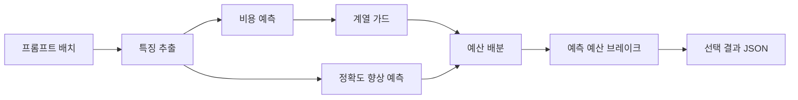

<!--
SPDX-FileCopyrightText: Copyright 2026 Scrooge Router contributors
SPDX-License-Identifier: Apache-2.0
-->

# 아키텍처

라우터는 프롬프트 묶음 하나를 받아 문항마다 모델 하나를 고른 JSON을
내놓습니다. 모델을 호출하지 않고, 네트워크도 쓰지 않으며, 표준 라이브러리만
사용합니다.

## 전체 흐름



특징은 프롬프트 텍스트에서만 뽑습니다. 문항 ID, 입력 순서, 등급 이름,
정답은 읽지 않습니다. 같은 프롬프트는 배치 안 어디에 있든 같은 결과를
받습니다.

## 네 계층

각 계층은 아래 계층의 예측을 그대로 쓰고 예산을 커밋하는 방식만 바꿉니다.

```
budget_brake_router      예측 예산 브레이크  ← 제출되는 라우터
      │
family_guard_router      계열 가드
      │
feasibility_ladder       사다리 배분
      │
cost_calibrated_router   비용·품질 예측
```

### 1층: 비용과 정확도 향상 예측

`cost_calibrated_router`가 프롬프트를 두 갈래 특징으로 바꿉니다. 길이,
문장 수, 기호 구성 같은 구조 특징과, 토큰을 고정 개수 통에 넣는 해시
특징입니다. 동결된 아티팩트에 담긴 능선 회귀 계수로 두 가지를 예측합니다.

- 각 모델이 쓸 토큰 수. 공개 비용 정책의 단가를 곱해 비용이 됩니다.
- 비싼 모델로 올렸을 때 오르는 정답 확률.

그다음 정확도 향상을 추가 비용으로 나눈 값이 큰 순서로 예산이 닿는 데까지
모델을 올립니다.

해시는 FNV-1a를 씁니다. 컨테이너에는 같은 함수의 C 구현을 함께 넣어
빌드하고, 없으면 순수 Python 경로로 동작합니다. 결과는 같습니다.

### 2층: 사다리 배분

`feasibility_ladder`는 1층의 예측을 그대로 받되, 예산을 상한 하나로 쓰지
않고 검사를 차례로 통과시킵니다.

| 단계 | 하는 일 |
| --- | --- |
| 순위 보정 | 예측 증분을 10개 구간으로 나눠 구간별 실제/예측 비율을 곱함 |
| 폭주 가드 | 혼자서 배치 예산의 큰 몫을 먹는 증분을 잘라냄 |
| 상향 개수 상한 | 비싼 모델로 올리는 문항 수를 전체의 일정 비율 이하로 제한 |

순위 보정은 Train에서 한 번 학습해 아티팩트에 굳혔습니다. 구간별 배수는
증가하지 않도록 강제하고 `[0.5, 6.0]`으로 자릅니다. 실행 중에는 다시
학습하지 않습니다.

### 3층: 계열 가드

`family_guard_router`가 프롬프트 텍스트만으로 문항을 몇 가지 묶음으로
나누고, 예측이 자주 빗나가는 묶음의 **회계상** 비용을 올린 뒤 2층의
배분기를 돌립니다.

지금 가드가 걸린 묶음은 어느 형태에도 해당하지 않는 잔여 묶음 하나이고,
배수는 2.5입니다. 채점은 실제 비용으로 하므로, 이 값이 틀리면 다른 정책과
똑같이 예산 검사에 걸립니다. 배수는 아티팩트에 들어 있어 코드를 고치지 않고
바꿀 수 있습니다.

Premium 등급은 이 계층의 가드를 쓰지 않고 2층에 그대로 넘깁니다. Fast와
Balanced는 이 계층에서 결정이 끝납니다.

### 4층: 예측 예산 브레이크

`budget_brake_router`가 제출되는 라우터입니다. Balanced는 3층에 그대로
위임합니다. Fast는 한 묶음이 배치의 0.75 이상을 차지할 때만 예측 상한을
1.11에서 1.07로 내립니다. 폭주 가드 0.165는 바꾸지 않습니다. Premium은
받은 배치에서 잔여 묶음의 비율이 0.75 이상이면 부모의 Light→AX31 예측
증분에 2.5배를 적용하고 브레이크 제외 목록에 잔여 묶음을 더합니다. 그다음
2층의 두 행동 할당을 받은 뒤, 부모가 `ax31`을 고른 문항 가운데 예측 품질
이득이 양수인 것만 `axk1-think`로 올립니다.

승격은 개수가 아니라 비율로 묶습니다. 배치 자체의 예측 light 합을 분모로
두고, 예측 Premium 비율이 3.80을 넘지 않는 동안만 고릅니다. 맞지 않는
행은 건너뛰고 계속 스캔하며, 개수 상한 48에서 멈춥니다. 혼자 배치 light의
2%를 넘는 증분과 미리 정한 계열은 후보에서 제외합니다.

## 비용 비율

비용 비율은 같은 배치를 전부 가장 싼 모델로 처리했을 때의 비용을 1로 둔
상대값입니다. 등급마다 한도가 있고 넘기면 그 등급은 0점입니다.

| 등급 | 한도 | 최종 점수 가중치 |
| --- | ---: | ---: |
| Fast | 1.25 | 0.4 |
| Balanced | 2.0 | 0.3 |
| Premium | 4.0 | 0.3 |

배치 전체가 한 번에 들어오므로 분모도 배치마다 정해집니다. 문항 하나를
따로 볼 수 없고 항상 묶음 단위로 판단해야 하는 이유입니다.

## 아티팩트

라우터는 학습을 실행 시점에 하지 않습니다. 모든 계수와 상한은 동결된
JSON에 들어 있습니다.

| 파일 | 쓰는 계층 |
| --- | --- |
| `budget-brake-router.v1.json` | 4층 |
| `family-guard-router.v1.json` | 3층 |
| `feasibility-ladder.v1.json` | 2층 |
| `cost-calibrated-router.v1.json` | 1층 |

네 파일 모두 `src/ossp_router/resources/`에 있습니다. 만들어낸 과정은
[실험 파이프라인](../research/README.md)에 있습니다.

## 확장 지점

계층이 나뉘어 있어 한 층만 바꿔 끼울 수 있습니다. 어디를 건드려야 하는지는
[로드맵과 확장 지점](roadmap.md)에 정리했습니다.
